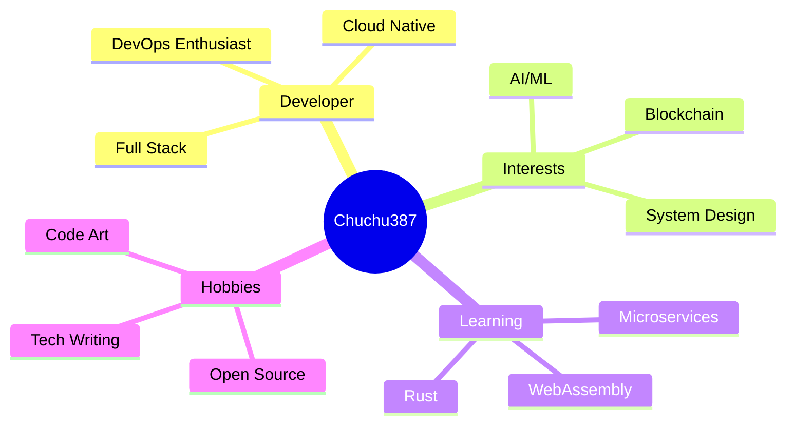

<div align="center">
  
  <!-- Custom SVG Header Banner -->
  ```svg
  <svg width="100%" height="150" viewBox="0 0 800 150" fill="none" xmlns="http://www.w3.org/2000/svg">
    <style>
      .header {
        animation: colorChange 10s ease-in-out infinite;
      }
      @keyframes colorChange {
        0%, 100% { fill: #ff6b6b; }
        50% { fill: #4ecdc4; }
      }
    </style>
    <rect class="header" width="100%" height="150"/>
    <text x="50%" y="50%" text-anchor="middle" alignment-baseline="middle" font-family="Arial" font-size="40" fill="white">
      chuchu387's Tech Wonderland
    </text>
  </svg>
  ```

  <!-- Animated Introduction -->
  
  
  <!-- Animated Tech Stack Cube -->
  <a href="https://github.com/chuchu387">
    
  </a>
</div>

<!-- Innovative About Me Section -->
<details>
<summary align="center">🎯 About Me | Click to Expand</summary>
<div align="center">



</div>
</details>

<!-- Animated Skill Progress Bars -->
<h2 align="center">🛠️ Technology Arsenal</h2>
<div align="center">

```json
{
  "languages": {
    "JavaScript": "████████████████████ 100%",
    "Python": "██████████████████░░ 90%",
    "Java": "████████████████░░░░ 80%",
    "Go": "████████████░░░░░░░░ 60%"
  },
  "frameworks": {
    "React": "████████████████████ 100%",
    "Node.js": "██████████████████░░ 90%",
    "Django": "████████████████░░░░ 80%",
    "Docker": "██████████████░░░░░░ 70%"
  }
}
```

</div>

<!-- Innovative Stats Display -->
<h2 align="center">📊 Code Journey</h2>
<div align="center">
  
  
</div>

<!-- Interactive Project Showcase -->
<h2 align="center">🌟 Epic Projects</h2>
<div align="center">
<table>
<tr>
<td width="50%">
<h3 align="center">Project Nova 🚀</h3>
<div align="center">
<a href="https://github.com/chuchu387/project-link" target="_blank"></a>
<p>
<a href="https://github.com/chuchu387/project-link" target="_blank">

</a>
<a href="https://project-link.com" target="_blank">

</a>
</p>
<p><strong>NextJS, TypeScript, ThreeJS</strong> - An innovative virtual reality experience</p>
</div>
                                                                                      
</td>

<td width="50%">
<h3 align="center">Project Quantum ⚡</h3>
<div align="center">
<a href="https://github.com/chuchu387/project-link" target="_blank"></a>
<p>
<a href="https://github.com/chuchu387/project-link" target="_blank">

</a>
<a href="https://project-link.com" target="_blank">

</a>
</p>
<p><strong>Rust, WebAssembly, React</strong> - High-performance web computing platform</p>
</div>
</td>
</tr>
</table>
</div>

<!-- Contribution Graph with Custom Theme -->
<h2 align="center">🏃‍♂️ Contribution Marathon</h2>

[](https://github.com/chuchu387)

<!-- Trophies with Custom Theme -->
<div align="center">
 <br><br>
</div>

<!-- Innovative Connect Section -->
<h2 align="center">🤝 Let's Connect & Create</h2>
<div align="center">
  
  [](https://twitter.com/your-handle)
  [](https://linkedin.com/in/your-profile)
  [](https://github.com/chuchu387)
  [](https://dev.to/your-profile)

</div>

<!-- Animated Footer -->
<div align="center">
  
  ```javascript
  while (alive) {
    eat();
    sleep();
    code();
    repeat();
  }
  ```
  
</div>

<!-- Profile Views Counter -->
<p align="center">
  
</p>

<!-- Custom SVG Wave -->

